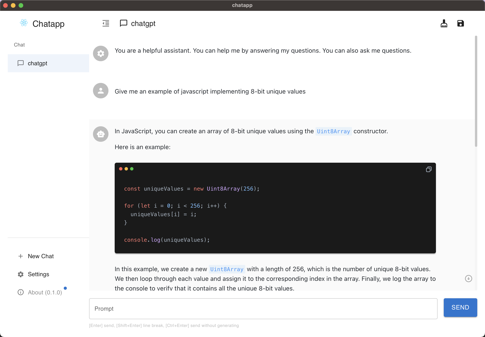
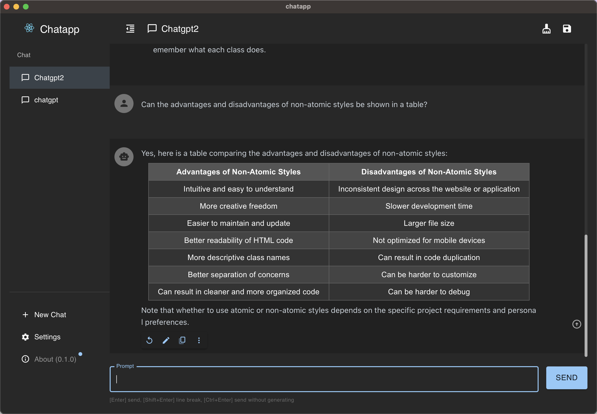

<h1 align="center">

<span>Chatapp</span>
</h1>
<!-- <p align="center">
<a href="./README.md">English</a> | 中文介绍
</p> -->
<p align="center">
<em>An open-source ChatGPT API (OpenAI API) desktop client, a Prompt debugging and management tool, supporting Windows, Mac, and Linux</em>
</p>

<p align="center">
<a href="[https://github.com/GolderBrother/chatapp/releases](https://github.com/GolderBrother/chatapp/releases)" target="_blank">

</a>
<a href="[https://github.com/GolderBrother/chatapp/releases](https://github.com/GolderBrother/chatapp/releases)" target="_blank">

</a>
<a href="[https://github.com/GolderBrother/chatapp/releases](https://github.com/GolderBrother/chatapp/releases)" target="_blank">

</a>
<a href="[https://github.com/GolderBrother/chatapp/releases](https://github.com/GolderBrother/chatapp/releases)" target="_blank">

</a>
</p>

<table>
<tr>
<td>

</td>
<td>

</td>
</tr>
</table>

## Features

- More flexible and powerful Prompt capabilities
- Data stored locally, no loss
- Supports GPT-4 and other models
- Supports custom domain proxies
- More features: Markdown, message quoting, word and token estimation, night mode, etc.
- Ergonomic UI design
- Installation package provided, no deployment required
- Free and open-source

## Download

*Chatapp supports all major operating systems, including: Windows, Mac (Intel, M1), and Linux.*

### Download from the official website

Please visit **[chatapp.xyz](https://chatapp.xyz/)** to download the latest version.

### Download from Github Releases

You can visit **[Github Releases](https://github.com/GolderBrother/chatapp/releases)** to browse and download all historical versions.

### Download via package manager

### [aur](https://aur.archlinux.org/packages/chatapp-bin)

If you are using Arch Linux, you can download and install Chatapp via AUR:

```bash
paru -S chatapp-bin

```

## Why did I develop Chatapp?

At first, I was just debugging some prompts, and I found that I really needed a simple and easy-to-use prompt and interface debugging tool, so I developed the initial version of Chatapp. I thought there might be more people who needed such a tool, so I made it open-source.

At that time, I didn't know that so many people would like it. So I tried my best to listen to the feedback from the open-source community, constantly develop and improve it, and now it has become a very easy-to-use AI desktop application. Now there are many users who like Chatapp, and they not only use it for development and debugging prompts but also for daily chatting and even for some more interesting things, such as using carefully designed prompts to let AI play various professional roles to assist them in some daily tasks...

## Relationship between Chatapp and (OpenAI API)

- Chatapp only provides a UI interface to help you better use the ChatGPT API (OpenAI API).
- For any questions related to ChatGPT API (OpenAI API), please visit [platform openai](https://platform.openai.com/)

## Roadmap

- [x]  AI chat and conversation management
- [x]  Local storage of chat messages and conversations
- [x]  Beautification of conversation message content (markdown)
- [x]  Streaming typewriter effect
- [x]  API Host configuration
- [x]  Auto-generated tab titles
- [x]  Message cleanup button
- [x]  Night mode
- [x]  Token estimation for messages
- [x]  GPT4 support
- [x]  Chinese (Simplified, Traditional)
- [x]  Copy button for code blocks
- [x]  Stop generation button
- [x]  Drag-and-drop sorting for tabs
- [ ]  Compatibility with Azure OpenAI API
- [ ]  Better prompt settings
- [ ]  Support for prompt word database
- [ ]  Prompt Library
- [ ]  Ability to send files and discuss files
    - [ ]  PDF reading: Can read PDF and other files, and answer based on the content of the PDF
- [ ]  Ability to send links and discuss web pages
    - [ ]  URL reading: Can read URL and other content, and answer based on the content of the URL
- [ ]  Mobile (iOS, Android)
- [ ]  Cross-device conversation synchronization
- [ ]  Threads (like Slack)
- [ ]  Management mode: Built-in administrator mode, can view the number of conversations for each user
- More...

## How to Contribute

Any form of contribution is welcome, including but not limited to:

- Submit pull requests
- Submit feature requests
- Submit bug reports
- Submit documentation revisions
- Submit translations
- Submit any other form of contribution
- Submit issues

Please note:

1. Before submitting an issue, make sure there is no duplicate topic issue.
2. Make sure the title is concise and clear, and the description is detailed enough.

## License

[GNU General Public License v3.0](./LICENSE)